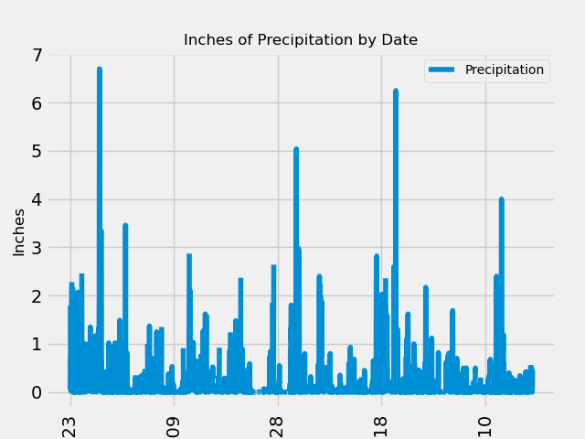
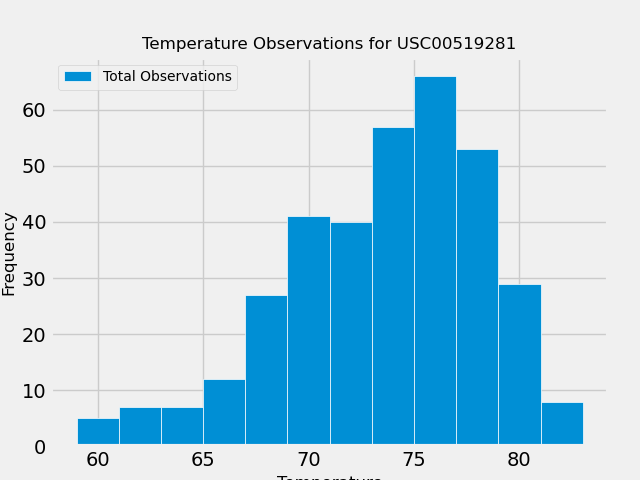

# sqlalchemy-challenge

This project uses Flask and SQLAlchemy to analyze climate data from observation stations in Honolulu, Hawaii. 

## Code Notes
The Flask app and IPYNB file can be found in the climate folder. The resources file contains the original CSV files of the data, as well as the SQLite database into which they were imported.

Images generated from the analysis can be found in the images folder.

## Charts

_Precipitation Observations_

_Temperature Observations_